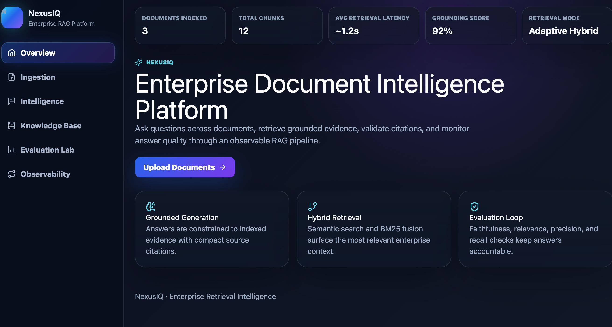
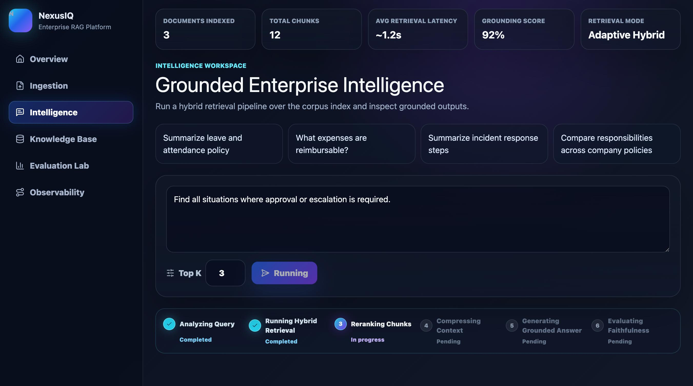
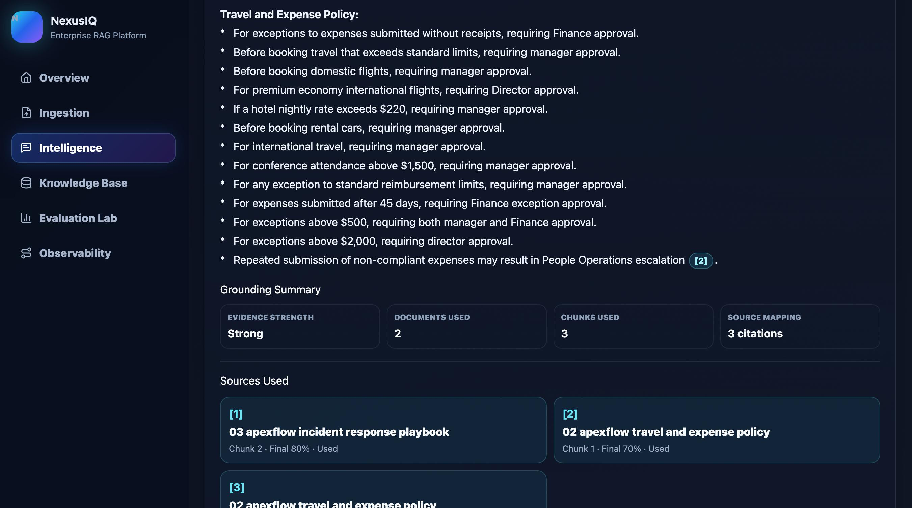
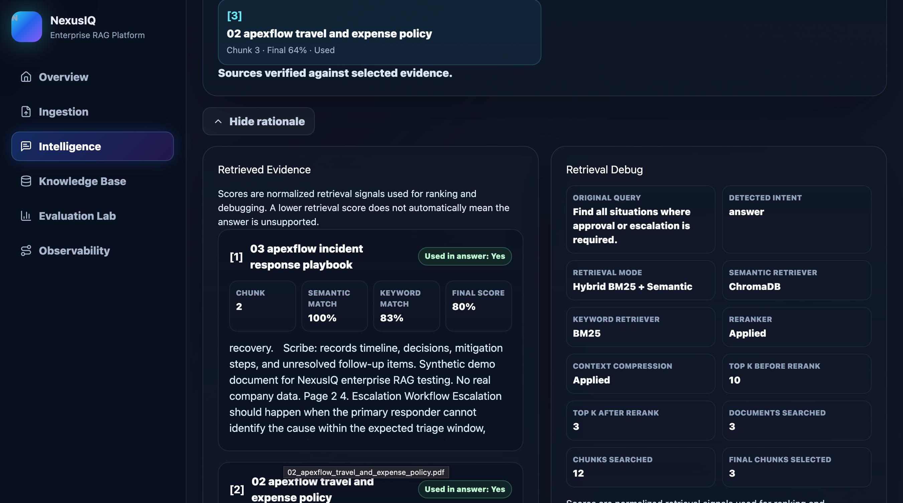
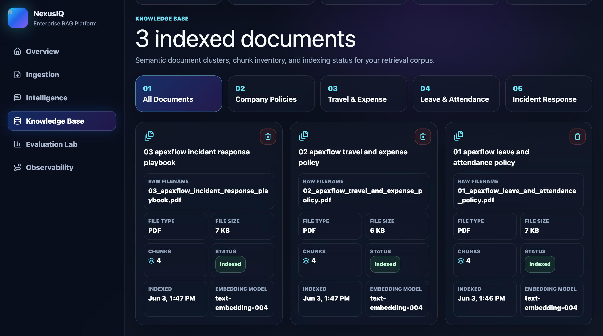
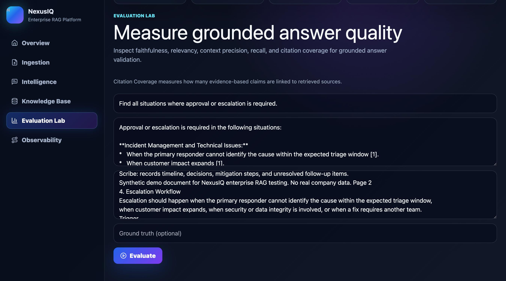
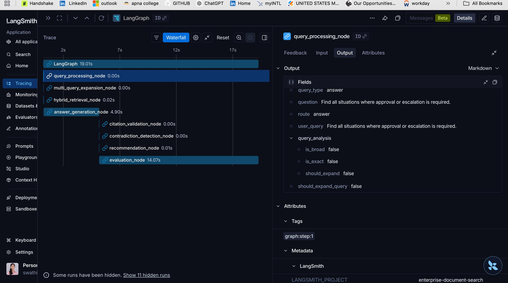

# NexusIQ: Enterprise Retrieval Intelligence

NexusIQ is a local enterprise-style retrieval intelligence platform for internal company documents. The demo focuses on a realistic corporate knowledge workflow: employees and operators need reliable answers from HR policies, travel and expense rules, and incident response playbooks, with clear evidence for every answer.

The project is built as an end-to-end RAG system for traceable internal knowledge retrieval. It covers ingestion, chunking, indexing, hybrid BM25 + semantic retrieval, reranking, context compression, citation-grounded generation, RAGAS-style evaluation, and LangSmith observability. The main engineering goal is to make internal document search inspectable: what was retrieved, why it ranked, what evidence was used, how strong the answer is, and where latency is spent.

## Demo Preview



Platform overview showing indexed documents, retrieval mode, grounding score, and core RAG capabilities.



Internal knowledge search workspace for asking policy and incident-response questions across the company corpus.



Grounded policy answer with source mapping and cited evidence from the internal corpus.



Retrieved evidence inspection showing source chunks, ranking signals, and why the answer was supported.



Knowledge Base view for managing the indexed internal document corpus.



Evaluation Lab for validating answer quality using faithfulness, relevancy, context, and citation metrics.

## Project Goal

The goal of NexusIQ is to model how an internal enterprise document search system should behave when answers affect operational decisions. In this demo domain, users are asking about approvals, reimbursements, leave policies, and incident escalation. Those answers need to be fast, cited, debuggable, and measurable.

The project focuses on:

- Building a local internal company knowledge system
- Supporting multiple policy and operations documents in one searchable corpus
- Retrieving evidence through hybrid semantic + keyword search
- Reranking and compressing context before generation
- Producing cited answers instead of unsupported summaries
- Showing the retrieved chunks and ranking signals behind each answer
- Measuring answer quality with RAGAS-style metrics and fallback evaluators
- Capturing latency and node-level execution with LangSmith traces

Business outcomes demonstrated:

- Faster policy lookup across HR, finance, and incident response documents
- More auditable answers through citations, evidence cards, and retrieval debug views
- A measurable feedback loop for improving retrieval and answer quality

## Demo Corpus

The demo uses a synthetic internal company corpus for ApexFlow Technologies:

- `01_apexflow_leave_and_attendance_policy.pdf`
- `02_apexflow_travel_and_expense_policy.pdf`
- `03_apexflow_incident_response_playbook.pdf`

The documents are fictional and safe to publish. They simulate internal enterprise knowledge such as leave approval rules, travel reimbursement limits, exception handling, incident severity, escalation windows, and ownership handoffs.

## Key Features

- **Document ingestion and corpus management:** Upload PDFs, clean extracted text, split documents into chunks, generate embeddings, and track indexed metadata.
- **Hybrid retrieval and reranking:** Combine BM25 keyword search with ChromaDB semantic retrieval, then rerank and compress selected evidence.
- **Grounded answer generation:** Generate cited answers using retrieved context and map citations back to source chunks.
- **Evidence and retrieval debugging:** Inspect supporting chunks, semantic scores, keyword scores, final ranking signals, and selected context.
- **Evaluation Lab:** Measure faithfulness, answer relevancy, context precision, context recall, and citation coverage.
- **LangSmith observability:** Trace LangGraph node execution, latency, inputs, outputs, and evaluation status.

## Methodology and Architecture

1. **Document Ingestion**  
   Internal PDF documents are uploaded, parsed, normalized, and split into retrieval-friendly chunks.

2. **Index Construction**  
   Chunks are embedded with `text-embedding-004` and stored in ChromaDB. A BM25 index is built over the same chunks for keyword retrieval.

3. **Query Analysis**  
   The system classifies the query intent. Broad operational questions can trigger multi-query expansion to improve recall across multiple documents.

4. **Hybrid Retrieval**  
   Semantic retrieval and BM25 retrieval run over the corpus. Their results are fused to identify candidate evidence chunks.

5. **Reranking**  
   Candidate chunks are reordered with final relevance scores so the strongest evidence appears first.

6. **Context Compression**  
   Retrieved context is trimmed before generation to reduce prompt noise and keep latency controlled.

7. **Grounded Generation**  
   Gemini 2.5 Flash in the current demo generates an answer using retrieved context and includes citation markers for factual claims.

8. **Citation Validation**  
   The answer is checked to verify that cited claims map back to retrieved evidence.

9. **Evaluation**  
   The system computes quality metrics including faithfulness, answer relevancy, context precision, context recall, and citation coverage. The backend includes RAGAS as the evaluation framework and falls back to local heuristics when judge configuration is unavailable.

10. **Observability**  
    LangSmith captures the LangGraph execution trace so latency, inputs, outputs, and node-level behavior can be inspected after each run.

Architecture summary:

- **Frontend:** React, Vite
- **Backend:** FastAPI
- **Graph orchestration:** LangGraph
- **LLM:** Gemini 2.5 Flash in the current demo
- **Vector store:** ChromaDB
- **Keyword retrieval:** BM25
- **Embeddings:** `text-embedding-004`
- **Evaluation:** RAGAS, Gemini judge, and fallback heuristics
- **Observability:** LangSmith
- **Storage:** SQLite/local metadata

## Code Structure

```text
NexusIQ/
├── frontend/
│   ├── src/
│   │   ├── components/
│   │   ├── pages/
│   │   ├── services/
│   │   └── App.jsx
│   └── package.json
├── backend/
│   ├── app/
│   │   ├── api/
│   │   ├── workflows/
│   │   ├── retrieval/
│   │   ├── evaluation/
│   │   ├── ingestion/
│   │   └── main.py
│   ├── requirements.txt
│   └── .env.example
├── sample_corpus/
│   ├── 01_apexflow_leave_and_attendance_policy.pdf
│   ├── 02_apexflow_travel_and_expense_policy.pdf
│   └── 03_apexflow_incident_response_playbook.pdf
├── assets/
│   └── screenshots/
└── README.md
```

- `frontend` handles the dashboard, ingestion flow, intelligence workspace, knowledge base, evaluation lab, and observability views.
- `backend` handles ingestion, retrieval, answer generation, validation, evaluation, and trace integration.
- `workflows` contains the LangGraph orchestration and graph nodes.
- `retrieval` contains BM25 retrieval, ChromaDB semantic retrieval, fusion, score normalization, reranking, and context compression.
- `evaluation` contains RAGAS-style quality scoring, Gemini judging, fallback heuristics, and citation coverage logic.

## Evaluation Results

The demo query used was:

> Find all situations where approval or escalation is required.

| Metric            | Result | Meaning                                                    |
| ----------------- | -----: | ---------------------------------------------------------- |
| Faithfulness      |   100% | Answer was supported by retrieved evidence                 |
| Answer Relevancy  |   100% | Answer directly addressed the query                        |
| Context Precision |    60% | Some retrieved chunks were useful while others added noise |
| Context Recall    |   100% | Retrieved context had enough information to answer         |
| Citation Coverage |   100% | Factual claims were linked to retrieved evidence           |

These scores come from a local demo run over the synthetic ApexFlow corpus. They validate the pipeline behavior for this controlled internal-docs scenario; they are not a broad benchmark across large enterprise datasets.

The lower context precision is useful because it shows the evaluator is not blindly assigning perfect scores. The system retrieved enough context to answer correctly, but some retrieved chunks were less directly relevant.

## Observability

NexusIQ uses LangSmith to trace each LangGraph run. This is important because retrieval systems fail in ways that are hard to see from the final answer alone. A trace shows where time was spent, which chunks were retrieved, how each node transformed state, and whether validation or evaluation passed.

Traced nodes include:

- `query_processing_node`
- `multi_query_expansion_node`
- `hybrid_retrieval_node`
- `answer_generation_node`
- `citation_validation_node`
- `contradiction_detection_node`
- `recommendation_node`
- `evaluation_node`



## Development Challenges and Solutions

**1. Cleaning PDF text for retrieval**  
Some PDF text was extracted with broken spacing, repeated headers, and noisy line breaks. I added text normalization and chunk cleanup before storing documents in the index.

**2. Improving retrieval quality**  
Semantic search alone missed exact policy terms, while keyword search missed broader questions. I combined BM25 with ChromaDB semantic retrieval and reranked the merged results.

**3. Managing LangGraph pipeline state**  
The pipeline had multiple nodes for query analysis, retrieval, generation, citation validation, recommendation, contradiction detection, and evaluation. I used a shared structured graph state so each node could pass clean outputs to the next step.

**4. Mapping citations to evidence**  
Early answers could cite sources inconsistently. I assigned stable citation IDs to retrieved chunks before generation and reused the same mapping in the answer, sources, and evidence cards.

**5. Debugging latency and pipeline behavior**  
It was hard to know which step caused slow or weak responses. I added LangSmith tracing to inspect node-level inputs, outputs, timing, and status.


## How to Run Locally

```bash
git clone <repo-url>
cd NexusIQ
```

Backend:

```bash
cd backend
python -m venv venv
source venv/bin/activate
pip install -r requirements.txt
cp .env.example .env
uvicorn app.main:app --reload --port 8000
```

Frontend:

```bash
cd frontend
npm install
npm run dev
```

Environment variables:

```env
GOOGLE_API_KEY=
LANGSMITH_API_KEY=
LANGSMITH_TRACING=true
LANGSMITH_PROJECT=NexusIQ
LANGSMITH_ENDPOINT=https://api.smith.langchain.com
```

Optional Docker:

```bash
cp .env.example .env
docker compose up --build
```

## Example Queries

- What is the approval process for annual leave?
- What expenses require manager approval?
- How are SEV1 incidents escalated?
- Compare approval workflows across leave requests and expense reimbursements.
- Find all situations where approval or escalation is required.
- Summarize employee responsibilities across company policies.

## What This Project Demonstrates

- End-to-end RAG application design for internal company knowledge
- Hybrid BM25 + semantic retrieval
- Reranking and context compression
- Citation-grounded answer generation
- Citation-aware validation
- RAGAS-style evaluation and fallback scoring
- Latency-aware LangGraph orchestration
- LangSmith observability for retrieval systems
- Full-stack AI engineering across React, FastAPI, vector search, and LLM workflows

## Future Improvements

- User authentication and role-based access
- Larger internal document corpus
- Persistent cloud vector database
- Advanced reranker model
- Better PDF table extraction
- Batch evaluation dataset
- CI/CD deployment
- Admin controls for re-indexing and corpus versioning
- Department-level access policies for HR, finance, and engineering documents

## Conclusion

NexusIQ demonstrates how internal company document search can be built as a transparent retrieval and validation system. It combines ingestion, hybrid retrieval, reranking, citation-grounded generation, RAGAS-style evaluation, and LangSmith observability into a local enterprise-style platform for policy and operations knowledge.
